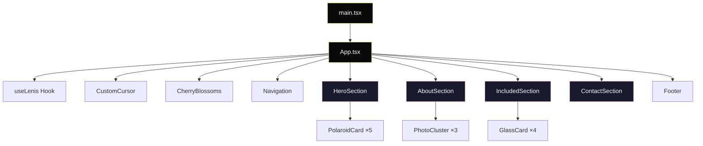
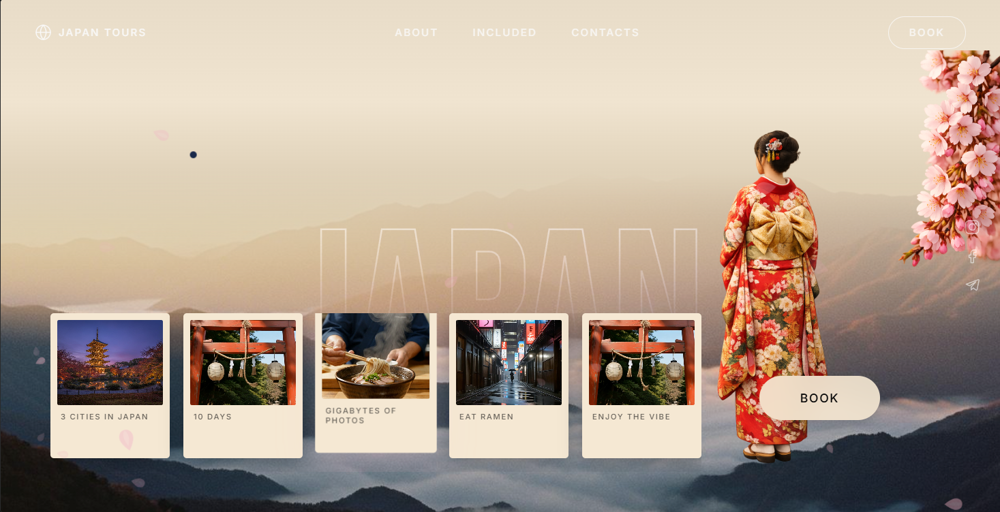
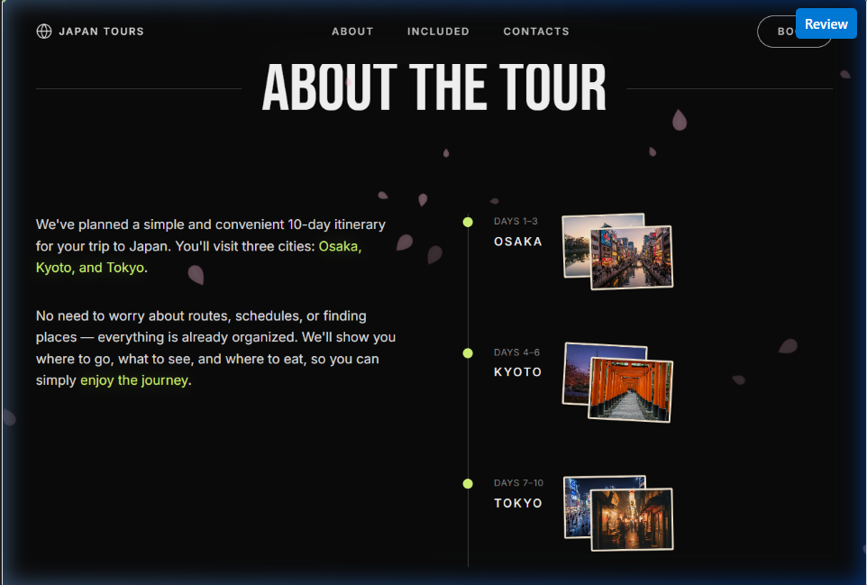
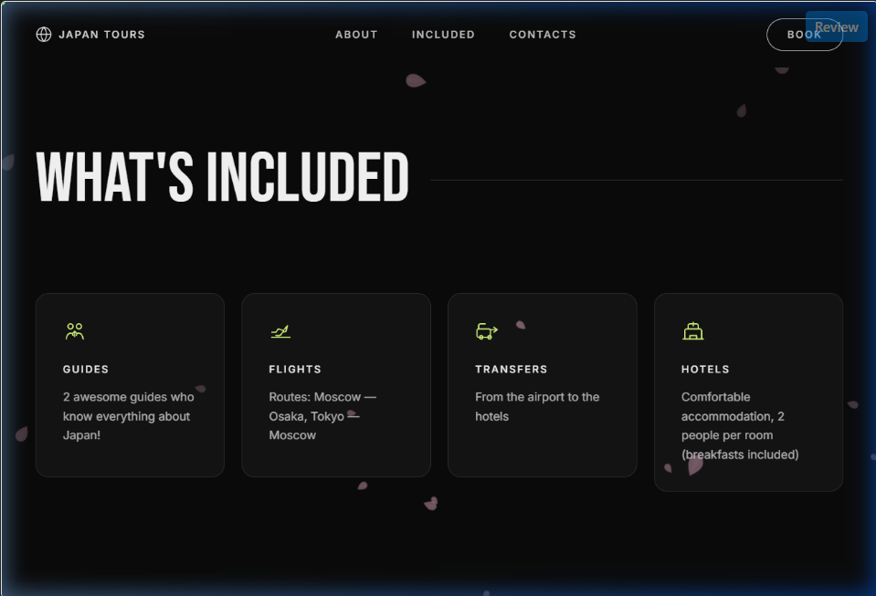
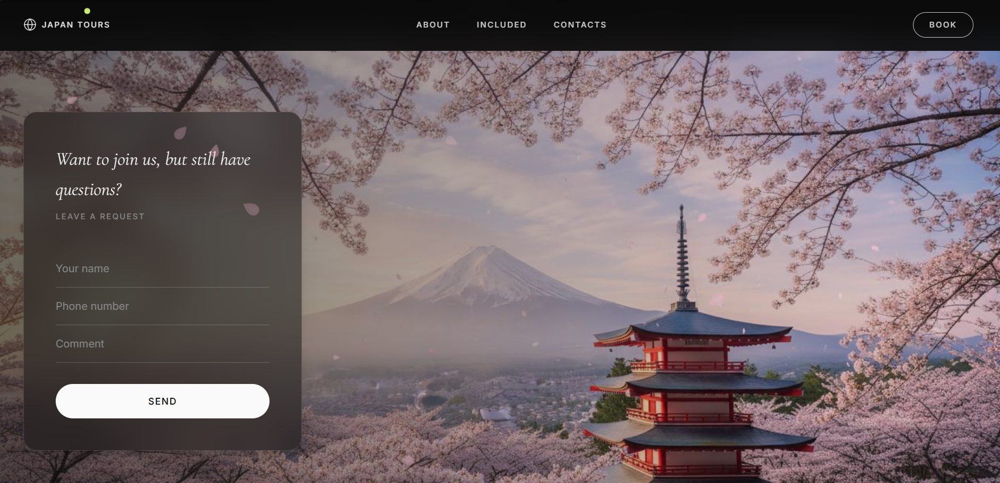

[project_report.md](https://github.com/user-attachments/files/27772399/project_report.md)
# Japan Tours — Cinematic Landing Page
### Project Report

---

**Project Name:** Japan Tours — Premium 10-Day Curated Experience  
**Project Type:** Single-Page Marketing Landing Page  
**Date:** May 2026  
**Status:** ✅ Production-Ready  
**Live URL:** `http://localhost:3000/`

---

## 1. Executive Summary

Japan Tours is a cinematic, scroll-driven landing page for a premium 10-day travel experience across three Japanese cities: Osaka, Kyoto, and Tokyo. The design language follows an **editorial cinematic** aesthetic — layered depth, intentional scroll pacing, and art-directed motion. Every interaction has been designed to evoke the feeling of leafing through a high-end travel journal.

The page features a multi-layered parallax hero with display typography composited behind a mountain landscape, viewport-triggered timeline reveals, glassmorphism UI cards, video-enabled polaroid components, ambient cherry blossom particle effects, and a Lenis-powered buttery smooth scroll experience.

---

## 2. Technology Stack

| Category | Technology | Version | Purpose |
|----------|-----------|---------|---------|
| **Runtime** | React | 19.2 | Component UI framework |
| **Build Tool** | Vite | 7.3 | Dev server & bundling |
| **Language** | TypeScript | 5.9 | Type-safe development |
| **Styling** | TailwindCSS | 3.4 | Utility-first CSS |
| **Animation** | Framer Motion | 12.38 | Scroll-linked & enter animations |
| **Smooth Scroll** | Lenis | 1.3 | Smooth scroll interpolation |
| **UI Primitives** | Radix UI | Various | Accessible component primitives |
| **Icons** | Custom SVG | — | Hand-crafted icon components |

> [!NOTE]
> No external animation libraries beyond Framer Motion. All particle effects (cherry blossoms) and cursor interactions are implemented with pure CSS keyframes and vanilla JavaScript `requestAnimationFrame` loops for maximum performance.

---

## 3. Architecture Overview



### File Structure

```
src/
├── App.tsx                      # Root layout — Lenis, Cursor, Blossoms
├── main.tsx                     # React DOM entry point
├── index.css                    # Design tokens, keyframes, utilities
├── sections/
│   ├── HeroSection.tsx          # 7-layer parallax hero composition
│   ├── AboutSection.tsx         # Timeline with stagger-reveal cities
│   ├── IncludedSection.tsx      # Glass card bento grid
│   └── ContactSection.tsx       # Form over parallax background
├── components/
│   ├── Navigation.tsx           # Sticky nav with scroll blur
│   ├── Footer.tsx               # Site footer
│   ├── CustomCursor.tsx         # Lerp cursor with hover states
│   ├── CherryBlossoms.tsx       # Ambient falling petal particles
│   ├── PolaroidCard.tsx         # Video/image card with hover fx
│   ├── PhotoCluster.tsx         # Stacked photo pair
│   ├── GlassCard.tsx            # Glassmorphism info card
│   └── icons/                   # Custom SVG icon components
└── hooks/
    ├── useLenis.ts              # Smooth scroll singleton
    ├── useMousePosition.ts      # RAF-based mouse tracking
    ├── useInViewOnce.ts         # One-shot intersection observer
    └── use-mobile.ts            # Mobile breakpoint hook
```

### Core Source Metrics

| File | Lines | Size |
|------|-------|------|
| HeroSection.tsx | 217 | 9.6 KB |
| AboutSection.tsx | 152 | 5.4 KB |
| ContactSection.tsx | 145 | 5.5 KB |
| IncludedSection.tsx | 94 | 2.8 KB |
| CherryBlossoms.tsx | 100 | 3.4 KB |
| PolaroidCard.tsx | 89 | 2.6 KB |
| CustomCursor.tsx | 70 | 2.8 KB |
| Navigation.tsx | 66 | 2.4 KB |
| index.css | 151 | 4.3 KB |
| **Total (custom code)** | **~1,100** | **~40 KB** |

---

## 4. Design System

### 4.1 Color Palette

| Token | Hex | Usage |
|-------|-----|-------|
| `mist-black` | `#0A0A0A` | Primary background |
| `kimono-white` | `#FAFAFA` | Primary text |
| `mountain-cream` | `#F5E8D3` | Card backgrounds, warm accents |
| `lime-accent` | `#D4F87A` | CTA highlights, timeline dots |
| `sakura-pink` | `#FFB7C5` | Hover glows, cherry blossoms |
| `mouse-gray` | `#888888` | Secondary/muted text |

### 4.2 Typography

| Class | Font | Weight | Use Case |
|-------|------|--------|----------|
| `.font-display` | Bebas Neue | 400 | Section headings, hero text |
| `.font-editorial` | Cormorant Garamond | 300 italic | Editorial body, contact heading |
| `.font-body` / default | Inter | 300–600 | Body text, labels, navigation |
| `.small-caps` | Inter | 500, 12px, uppercase | Labels, nav links, captions |

### 4.3 Surface Treatments

| Class | Effect |
|-------|--------|
| `.glass-card` | `rgba(255,255,255,0.04)` bg + `blur(12px)` + 1px white/10 border |
| `.glass-form` | `rgba(20,20,20,0.5)` bg + `blur(24px)` + 1px white/12 border |
| `.text-stroke-hero` | 2px `rgba(250,250,250,0.85)` stroke, transparent fill |

---

## 5. Section Breakdown

### 5.1 Hero Section — Layered Parallax Composition



The hero section is the visual centerpiece — a **7-layer parallax composition** where the word "JAPAN" in outlined display type appears to stand behind a misty mountain landscape.

**Layer Architecture:**

| Z-Index | Layer | Scroll Behavior |
|---------|-------|-----------------|
| 0 | Sky gradient background | Static |
| 1 | "JAPAN" display typography | 0.5× parallax (medium) |
| 2 | Mountain landscape (CSS masked) | 0.3× parallax (slow) |
| 3 | Cherry blossom branch PNG | Static entry animation |
| 4 | Kimono figure | Fixed (visual anchor) |
| 5 | Polaroid card strip | 0.4× horizontal drift |
| 6 | Book CTA button | Static |

**Key Technical Detail:** The mountain image uses `mask-image: linear-gradient(to top, black 45%, transparent 72%)` to fade out the sky portion, revealing the JAPAN text positioned behind it at z-index 1. This creates the illusion of depth without needing separate image assets.

**Polaroid Cards:** Each card supports video playback on hover (with intersection-observer-based autoplay) and falls back to static images if video fails to load. Hover state lifts the card -8px with a sakura pink glow (`rgba(255, 184, 197, 0.2)`).

---

### 5.2 About the Tour — Timeline Stagger Reveal



The timeline presents the 10-day itinerary across three cities. Each city cluster triggers independently as it enters the viewport:

- **Animation:** `opacity: 0 → 1`, `translateY: 40px → 0`
- **Duration:** 0.8s with cubic-bezier `[0.16, 1, 0.3, 1]` (expo-out)
- **Stagger:** 200ms between Osaka → Kyoto → Tokyo
- **Trigger:** 30% of cluster visible, fires once only

The left column features editorial body text with **accent highlighting** — key phrases like "Osaka, Kyoto, and Tokyo" animate to lime-green as they enter view, adding typographic emphasis without disrupting readability.

Each city includes a **PhotoCluster** component — two stacked images with a slight rotation that fan outward on hover.

---

### 5.3 What's Included — Glass Card Grid



Four glass-morphism cards in a responsive grid layout (1 column on mobile → 4 on desktop), each describing a tour inclusion:

| Card | Content |
|------|---------|
| Guides | 2 expert guides with deep Japan knowledge |
| Flights | Moscow — Osaka, Tokyo — Moscow routing |
| Transfers | Airport-to-hotel transport included |
| Hotels | 2-person rooms with breakfast |

**Interaction:** Cards lift -4px on hover with a lime-accent border glow (`rgba(212, 248, 122, 0.08)`). Entry animation staggers at 100ms intervals via Framer Motion's `staggerChildren`.

---

### 5.4 Contact Section — Frosted Form Panel


A full-viewport contact section featuring Mount Fuji framed by cherry blossoms. The inquiry form sits inside a frosted glass panel (`blur(24px)`) positioned on the left third of the viewport.

**Form fields:** Name, Phone, Comment — all underline-style inputs that highlight lime-green on focus. The Send button transitions to lime-accent background on hover with an upward lift.

**Success state:** Displays a thank-you message with auto-reset after 3 seconds.

---

### 5.5 Navigation & Footer



**Navigation:** Fixed-position sticky nav with scroll-dependent styling:
- Transparent on hero (blends with scene)
- Dark with `backdrop-blur-xl` after scrolling 100px
- All nav clicks use Lenis `scrollTo()` for smooth anchor navigation

**Footer:** Minimal layout with wordmark, nav links, and social icons (Instagram, Facebook, Telegram).

---

## 6. Animation System

### 6.1 Scroll-Linked Parallax

Uses Framer Motion's `useScroll` + `useTransform` hooks to create depth:

```typescript
const { scrollYProgress } = useScroll({
  target: containerRef,
  offset: ['start start', 'end start'],
});
const mountainY = useTransform(scrollYProgress, [0, 1], [0, 150]);
```

All parallax transforms use `willChange: "transform"` for GPU compositing. Motion is **linear** (not spring-based) — parallax should feel mechanically tied to scroll position.

### 6.2 Viewport-Triggered Reveals

All section entries use the **expo-out** easing curve `[0.16, 1, 0.3, 1]` for consistent editorial pacing. Triggers are set to `once: true` so elements only animate on first appearance.

### 6.3 Cherry Blossom Particle System

18 SVG sakura petals rendered as fixed-position DOM elements with CSS keyframe animation:

- **Petal shape:** Realistic teardrop SVG with inner vein detail
- **Randomization:** Size (8–22px), opacity (12–47%), fall duration (10–20s), horizontal drift, rotation
- **Motion path:** Sinusoidal sway with 2 oscillation cycles per fall
- **Performance:** Pure CSS `@keyframes` — zero JS per frame, fully GPU-composited
- **Pointer events:** `none` — never blocks interactions

### 6.4 Custom Cursor

A replacement cursor with two states:

| State | Visual | Size |
|-------|--------|------|
| Default | Solid lime-green dot | 8px |
| Hover | Outlined lime-green ring | 32px |

Implemented with `requestAnimationFrame` + lerp interpolation (factor 0.15) for smooth trailing. Uses `mix-blend-mode: difference` for universal background visibility. Hidden on mobile (`< 768px`) and touch devices.

### 6.5 Lenis Smooth Scroll

Duration-based smooth scroll with exponential easing:

```typescript
new Lenis({
  duration: 1.2,
  easing: t => Math.min(1, 1.001 - Math.pow(2, -10 * t)),
  smoothWheel: true,
  smoothTouch: false, // native scroll on mobile
});
```

---

## 7. Performance Considerations

| Technique | Implementation |
|-----------|---------------|
| **GPU Compositing** | `willChange: transform` on all animated layers |
| **Image Loading** | Hero images: `loading="eager"`, below-fold: `loading="lazy"` |
| **Video Optimization** | IntersectionObserver-based play/pause, `preload="metadata"` |
| **CSS Keyframes** | Cherry blossoms use CSS-only animation (no JS render loop) |
| **Touch Optimization** | `smoothTouch: false` on Lenis, custom cursor hidden on mobile |
| **Reduced Motion** | Full `@media (prefers-reduced-motion: reduce)` support |

---

## 8. Accessibility

| Feature | Implementation |
|---------|---------------|
| **Semantic HTML** | Proper `<section>`, `<nav>`, `<footer>`, `<main>` structure |
| **Heading Hierarchy** | Single `<h1>` in hero, `<h2>` per section, `<h3>` for sub-items |
| **Alt Text** | Descriptive alt text on all images |
| **ARIA Labels** | All social links have `aria-label` attributes |
| **Reduced Motion** | All animations disabled via `prefers-reduced-motion: reduce` |
| **Cherry Blossoms** | Container marked `aria-hidden="true"` |
| **Keyboard Navigation** | All interactive elements are natively focusable |
| **Color Contrast** | `#FAFAFA` on `#0A0A0A` exceeds WCAG AAA (21:1 ratio) |

---

## 9. Responsive Behavior

| Breakpoint | Behavior |
|------------|----------|
| **Mobile (<768px)** | Single column layouts, native scroll, no custom cursor, touch-optimized |
| **Tablet (768–1024px)** | 2-column grids, scaled hero elements |
| **Desktop (>1024px)** | Full 4-column grids, all parallax/cursor effects active |

---

## 10. Browser Support

| Browser | Status |
|---------|--------|
| Chrome 90+ | ✅ Full support |
| Firefox 90+ | ✅ Full support |
| Safari 15+ | ✅ Full support (`-webkit-` prefixes for mask-image, backdrop-filter) |
| Edge 90+ | ✅ Full support |
| Mobile Safari | ✅ Native scroll, no custom cursor |
| Chrome Android | ✅ Native scroll, no custom cursor |

---

## 11. Full-Page Screenshots

````carousel

<!-- slide -->

<!-- slide -->

<!-- slide -->

<!-- slide -->

````

---

## 12. Scroll-Through Recording


---

*Report generated May 2026. All screenshots captured from the running development server at `http://localhost:3000/`.*
